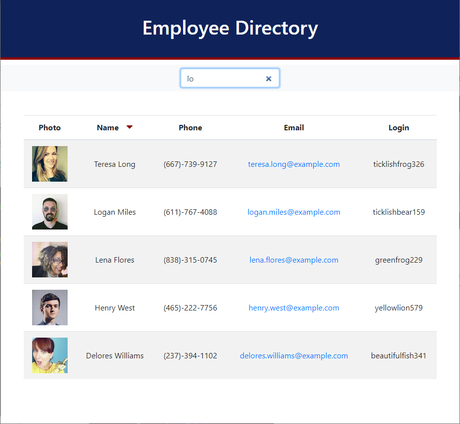

# Employee Directory

## Description

Displays an entire employee directory for quick access to view their photo, name, phone, email, and login.  Can filter employees by all fields and sort by name.

## Table of Contents 

* [Website](#Website)

* [Usage](#Usage)

* [License](#License)

* [Repository](#Repository)

* [Questions](#Questions)

## Website:

[https://jrdrenth.github.io/employeedirectory/](https://jrdrenth.github.io/employeedirectory/)

## Usage

Click the red caret next to the column header `Name` to toggle sorting.  Enter text in the search box to filter the list.  The following image shows the web application's appearance.

## License:

This app is licensed under the MIT license.

## Repository:

[https://github.com/jrdrenth/employeedirectory](https://github.com/jrdrenth/employeedirectory)

## Questions:

If you have any questions, please contact me at john.drenth@gmail.com.  My github profile can be found at [https://github.com/jrdrenth/](https://github.com/jrdrenth/).
